<!-- ### Hi there 👋 -->

   <h1>Hi there, I'm <a href="https://github.com/chenqianhe">Chen Qianhe</a> 👋 </h1>

I like new things and overcoming challenges(Web Developer 🌐 , AI 🤖 , PM 📄 , Data Vis 🎨) depending on what the project requires. 

I love exploring new tech stack 💻 and leveraging them to build something meaningful 🛠️.

<!-- **chenqianhe/chenqianhe** is a ✨ _special_ ✨ repository because its `README.md` (this file) appears on your GitHub profile.

Here are some ideas to get you started: -->

- 🔭 I am currently working full-time on open source projects([Autocut](https://github.com/mli/autocut), [FastDeploy](https://github.com/PaddlePaddle/FastDeploy) and my own projects)
- 📔 Most of my blogs are available on [Zhihu](https://www.zhihu.com/people/chen-qian-he-52/columns)
- 💬 Ask me about technical problems or good ideas, and I'll be happy to communicate with you
- 📫 How to reach me: qianhechen01@gmail.com
<!-- - 😄 Pronouns: ... -->
<!-- - ⚡ Fun fact: ... -->
<!-- - 🌱 I’m currently learning ... -->
<!-- - 👯 I’m looking to collaborate on ... -->
<!-- - 🤔 I’m looking for help with ... -->

### 🔨 Languages and Tools

<!--   -->

<!--   -->

<!--   -->

### 🔔 My Websites

- [SciColor](https://scicolor.datavizu.app): A website designed to create a color system specifically for scientific display.
- [Paper Tools](https://papertools.intrailblaze.com): A toolset link website focused on Latex paper writing.
- [Functional Programming Slides](https://fp-slides.intrailblaze.com)
- [DataVisTemplateProject](https://github.com/DataVizU/DataVisTemplateProject): A data visualization template project repository.

<!-- 
 -->
<!--    <h2>🔎 Github Status</h1> -->
<!--  -->
<!--      -->
<!-- 
 -->

### 👉 New Projects

<table>
  <thead align="center">
    <tr border: none;>
      <td><b>🎁 Projects</b></td>
      <td><b>📣 Intro</b></td>
      <td><b>🔖 Other Information</b></td>
    </tr>
  </thead>
  <tbody>
     <tr>
       <td><a href="https://github.com/DataVizU/augmented-radar-chart"><b>Augmented Radar Chart</b></td>
       <td>Simultaneously visualize single attribute of multidimensional data and distribution of each dimension..</td>
       <td><a href="https://doi.org/10.1016/j.visinf.2024.07.001"><b>Paper</b></a></td>
    </tr>
     <tr>
       <td><a href="https://github.com/DataVizU/JobWantedAnalysis-ChinaVis2024"><b>Job Wanted Analysis</b></td>
       <td>Analyze and Visualize job posts data.</td>
       <td>Nomination Award for ChinaVis 2024</td>
    </tr>
    <tr>
       <td><a href="https://github.com/chenqianhe/SoulEcho"><b>SoulEcho</b></td>
       <td>Connect Souls, Echo familiar Roles.</td>
       <td>Hackday Award Winning Project</td>
    </tr>
    <tr>
      <td><a href="https://github.com/DataVizU/RumorLens"><b>RumorLens</b></a></td>
      <td>Interactive Analysis and Validation of Suspected Rumors on Social Media.</td>
      <td><a href="https://dl.acm.org/doi/10.1145/3491101.3519712"><b>Paper</b></a></td>
    </tr>
    <tr>
      <td><a href="https://github.com/chenqianhe/VAD-addon"><b>VAD-addon</b></a></td>
      <td>Provides an addon that can perform VAD model reasoning in nodes and electric environments.</td>
      <td></td>
    </tr>
    <tr>
      <td><a href="https://github.com/chenqianhe/codegenJupyterLabExt"><b>codegenJupyterLabExt</b></a></td>
      <td>A code generation JupyterLab extension based on CodeGen model and PaddlePaddle.</td>
      <td></td>
    </tr>
  </tbody>
</table>

### ✨ Contribute To and Focus On

<table>
  <thead align="center">
    <tr border: none;>
      <td><b>🎁 Projects</b></td>
      <td><b>⭐ Stars</b></td>
      <td><b>📚 Forks</b></td>
      <td><b>📣 Intro</b></td>
    </tr>
  </thead>
  <tbody>
    <tr>
      <td><a href="https://github.com/mli/autocut"><b>Autocut</b></a></td>
      <td></td>
      <td></td>
      <td>✂Use text editor to cut videos.</td>
    </tr>
    <tr>
      <td><a href="https://github.com/PaddlePaddle/FastDeploy"><b>FastDeploy</b></a></td>
      <td></td>
      <td></td>
      <td>⚡️An Easy-to-use and Fast Deep Learning Model Deployment Toolkit.</td>
    </tr>
    <tr>
      <td><a href="https://github.com/ggerganov/whisper.cpp"><b>whisper.cpp</b></a></td>
      <td></td>
      <td></td>
      <td>🏅Port of OpenAI's Whisper model in C/C++.</td>
    </tr>
  </tbody>
</table>

### 🫶 Seeking Sponsorship

|WeChat|AliPay|Binance(ID: 453226889)|
|:---:|:---:|:---:|
||||
