<!-- ### Hi there 👋 -->

   <h1>Hi there, I'm <a href="https://github.com/chenqianhe">Chen Qianhe</a> 👋 </h1>

I like new things and overcoming challenges(Web Developer 🌐 , AI 🤖 , PM 📄 , Data Vis 🎨) depending on what the project requires. 

I love exploring new tech stack 💻 and leveraging them to build something meaningful 🛠️.

<!-- **chenqianhe/chenqianhe** is a ✨ _special_ ✨ repository because its `README.md` (this file) appears on your GitHub profile.

Here are some ideas to get you started: -->

- 🔭 I’m currently studying in Huazhong University of science and technology
- 📔 Most of my blogs are available on [Zhihu](https://www.zhihu.com/people/chen-qian-he-52/columns)
- 💬 Ask me about technical problems or good ideas, and I'll be happy to communicate with you
- 📫 How to reach me: chenqianhe01@qq.com
<!-- - 😄 Pronouns: ... -->
<!-- - ⚡ Fun fact: ... -->
<!-- - 🌱 I’m currently learning ... -->
<!-- - 👯 I’m looking to collaborate on ... -->
<!-- - 🤔 I’m looking for help with ... -->

### 🔨 Languages and Tools:

 

 

 

### 🔎 Github Status

### ✨ Contribute To and Focus On

